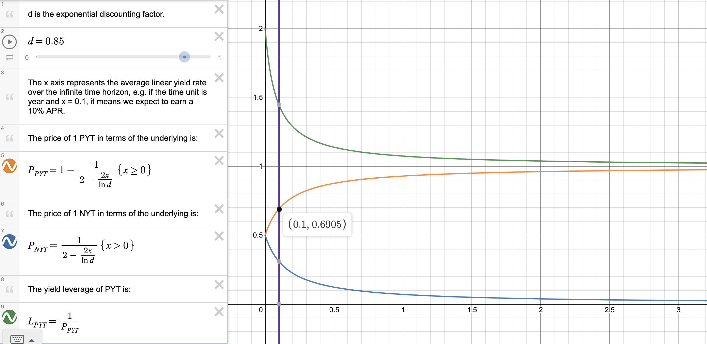

# Perpetual Yield Token (PYT)

## Intro

Timeless **perpetual yield tokens (PYT)** represent streams of future yield generated by the corresponding principal. 1 PYT always corresponds to 1 underlying principal, which makes accounting easier.

For example, say we have a PYT that uses the Yearn USDC vault to generate yield, then 1 PYT represents the right to claim the yield generated by 1 USDC in the Yearn USDC vault from now to forever in the future.

PYTs are useful because their prices move in the same direction as the yield rates of the yield-generating vaults they use, so it’s easy to use them to [speculate on yield rates](./yield-speculation). They're also useful for [yield boosting](./yield-boosting), where you buy PYT off the market at a discount to boost the yield you earn.

## How yield rate changes affect PYT's price

Intuitively, it makes sense that PYT's price changes when the yield rate changes: the more yield you can earn by holding PYT, the more value you can extract over time, the more premium you would demand when someone wants to buy your PYT.

However, it might not be obvious exactly which mechanisms connect the yield rate to PYT's price. Here is a basic overview.

### When the yield rate goes up 🔺

- Suppose that the yield boost 🚀 is at 1.5x and the yield rate is 10% per year 🌾, then by yield boosting 🚀 PYT holders 🧑‍🌾 earn an extra 5% per year 💸.
- If the yield rate goes up 🔺 to 50% per year 🌾🌾🌾🌾🌾, then PYT holders 🧑‍🌾 earn an extra 25% per year 💸💸💸💸💸
- This makes buying/holding PYT 🪙 more attractive ✨, so people buy more PYT 🪙, pushing the price up 🔺
- When PYT's 🪙 price goes up 🔺, the yield boost 🚀 goes down 🔻 (since it's 1 / PYT's price), which makes buying PYT less attractive 💩, eventually stopping the PYT price increase 🛑

### When the yield rate goes down 🔻

- Suppose that the yield boost 🚀 is at 1.5x and the yield rate is 50% per year 🌾🌾🌾🌾🌾, then by yield boosting 🚀 PYT holders 🧑‍🌾 earn an extra 25% per year 💸💸💸💸💸.
- If the yield rate goes down 🔻 to 10% per year 🌾, then PYT holders 🧑‍🌾 only earn an extra 5% per year 💸
- This makes buying/holding PYT 🪙 less attractive 💩, so people buy less PYT 🪙, and PYT holders 🧑‍🌾 will likely also sell their PYT 🪙 to use their money for more profitable purposes (e.g. trading NFTs). As a result, PYT's 🪙 price goes down 🔻.
- When PYT's 🪙 price goes down 🔻, the yield boost 🚀 goes up 🔺 (since it's 1 / PYT's price), which makes buying PYT more attractive ✨, eventually stopping the PYT price decrease 🛑

### How this affects NYT

The price of PYT + the price of NYT always equals 1 (in terms of the underlying asset), since if it was anything else, you can do a profitable arbitrage by either minting or burning PYT + NYT for 1 underlying asset.

This is why NYT's price moves in the opposite direction as PYT's price (and thus the yield rate).

## PYT price model

One thing that has caused confusion to friends who we have introduced Timeless to is: **how do you price PYTs & NYTs?**

This is a natural question, since even the concept of a yield token that's perpetual is baffling to some. After all, if you hold PYT, you have the right to claim the yield generated by the underlying principal **forever**, so won't the value of PYTs be infinite?

As you will see, this is far from the case, and there does exist a way to rationally price PYTs & NYTs. This is because we can employ [exponential discounting](https://en.wikipedia.org/wiki/Exponential_discounting), which basically says we can treat the value of _money in the future_ to be less than that of _money in the present_, because of the various ways we can generate returns if we had money now rather than later, such as yield farming or investing. Exponential discounting makes the value of PYTs finite, which makes it possible for us to price them.

In the rest of this section, we will describe exactly how to price PYTs and NYTs using some basic math. If you're uncomfortable with math, feel free to skip ahead to the [observations](#observations) section to see what we have observed from the results.

---

We will first consider regular yield bearing tokens. Suppose we have $x$ USDC’s worth of yUSDC. Our yUSDC has two types of value: **principal value** and **yield value**.

Principal value refers to the value of the underlying principal, which equals to $x$ in our case. We will denote principal value as

$$
P(x) = x
$$

Yield value refers to the value of the future yield generated by the principal. One might mistakenly think that the yield value is always infinite since the time horizon is infinite, but that’s only assuming we do not do any discounting (i.e. treat the value of 1 USDC at some future time to be less than that of 1 USDC in the present). Here, we will use exponential discounting with discount factor $\beta \in (0, 1)$. We will denote yield value as

$$
Y_\beta(x) = \int_0^\infty \beta^t y(x, t) dt
$$

where $y(x, t)$ is the instantaneous yield earned by $x$ amount of principal at time $t$.

One interesting note is that when you price the yield bearing tokens only the principal value is considered, since you can always mint/burn them just using the principal, but it’s obvious that the yield value is also valuable, since you would never give away the yield stream generated by your principal for free. This makes the yield value sort of ethereal / imaginary.

When we “split up” the yield bearing tokens into $x$ PYT and $x$ NYT, we will split up the principal value and yield value between them. Specifically, the principal value will be divided evenly between the PYT and NYT, and the yield value will be assigned to the PYT. We will define the virtual value of PYTs and NYTs as the following:

$$
V_{PYT}(x) = \frac12 P(x) + Y_\beta(x) = \frac12 x + Y_\beta(x)
$$

$$
V_{NYT}(x) = \frac12 P(x) = \frac12 x
$$

Virtual value represents the total value of PYT/NYT by adding up its principal value and its yield value. It is virtual in the sense that the PYT/NYT is not traded at this valuation, since if it did then the prices of PYT and NYT would add up to more than 1, but it is useful for determining the relative pricing between PYT and NYT since it captures both their principal value and their yield value.

We know the prices of PYT and NYT add up to 1, hence the price of PYT is:

$$
Price_{PYT} = \frac{V_{PYT}(x)}{V_{PYT}(x) + V_{NYT}(x)} = \frac{\frac12 x + Y_\beta(x)}{x + Y_\beta(x)} = 1 - \frac{x}{2(x + Y_\beta(x))}
$$

This expression isn’t that useful if we don’t replace $Y_\beta(x)$ with something more specific. Suppose that

$$
y(x, t) = \lambda x
$$

which means the yield is generated at a constant rate of $\lambda$ (e.g. if the time unit is year, $\lambda = 0.1$ means the APR is 10%). Linear growth is used rather than exponential growth because the yield is assumed to be continuously claimed by the PYT holder rather than compounded.

Thus, we have

$$
Y_\beta(x) = \lambda x \int_0^\infty \beta^t dt = \left. \frac{\lambda x}{\ln \beta} \beta^t \right\vert_{t=0}^\infty = - \frac{\lambda}{\ln \beta} x
$$

$$
\therefore Price_{PYT} = 1 - \frac{1}{2(1 -\frac{\lambda}{\ln \beta})}
$$

Another interesting note is that even though the yield bearing token’s yield value is “ethereal” such that it doesn’t affect the pricing, when we split the yield bearing token into PYT & NYT the yield value becomes “corporeal” and does affect the pricing.

### Observations

Now that we have a pricing formula for PYT, we can play around with it, plug in some numbers, and make some observations. We will use $\beta = 0.85$, and use year as the time unit.

[Desmos link](https://www.desmos.com/calculator/eqwyemvtwr)

Firstly, we can see that as the yield rate $\lambda$ increases, the slope of the price curve decreases and approaches 0. This means that **PYTs are more sensitive to yield rate changes when the yield rate is low**. For instance, if the yield rate increases from $5\%$ to $10\%$, the price of PYT goes from $0.6176$ to $0.6905$, a $11.80\%$ increase. If the yield rate increases again from $10\%$ to $15\%$, however, the price of PYT goes from $0.6905$ to $0.74$, only a $7.17\%$ increase.

Secondly, we can see that **the price of PYT is insensitive to yield rate changes**. As we just saw, doubling the yield rate from $5\%$ to $10\%$ only increases the price of PYT by $11.80\%$, which is far lower than the $100\%$ increase in the yield rate. This property is caused by the fact that the price of PYT is bounded between $0.5$ and $1$, meaning at best it can do a 2x, making PYTs usually very insensitive to yield rate changes.

**PYTs are more suitable for yield leveraging rather than speculation**. The most basic yield leveraging strategy is using your principal to buy PYTs on the market, versus depositing your principal into a vault directly. The amount of leverage you can get is $\frac{1}{Price_{PYT}}$, and the insensitivity of PYT means the leverage is usually significantly above 1x, while your principal's value is relatively stable. Of course, the leverage you get from this basic strategy is still pretty low, with a maximum of 2x leverage, but you can increase the leverage by employing a more complex strategy. For example, if there is a lending pool for the PYT, you can leverage up your PYT position to boost the yield leverage you get.

Thirdly, while the price of PYT is doomed to be insensitive, the same is not true of the price of NYT. Instead of ranging between $0.5$ and $1$, it ranges between $0$ and $0.5$, meaning it can theoretically increase by any proportion. For example, if the yield rate decreases from $80\%$ to $20\%$, the price of NYT goes from $0.0844$ to $0.2242$, a $165\%$ increase. Thus, **NYTs are more suitable for yield speculation than PYTs**.
