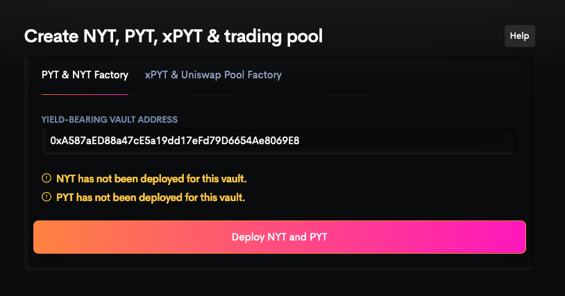
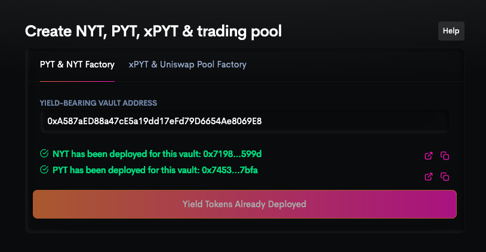
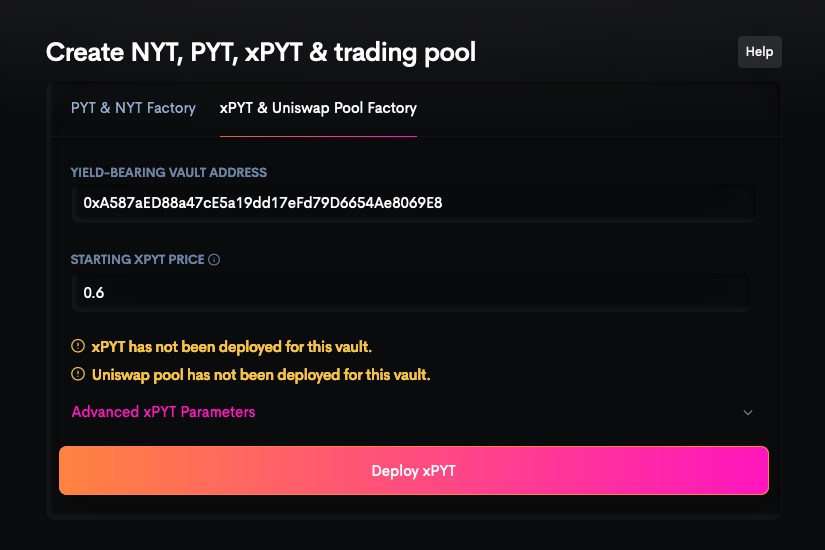
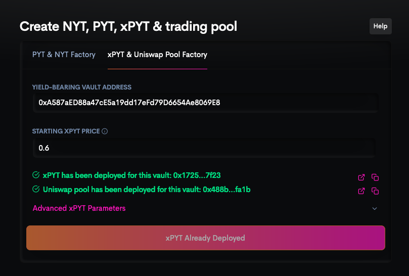

# Creating Yield Tokens & Liquidity Pools

Timeless is a permissionless protocol, meaning anyone can create [PYT](../concepts/pyt), [NYT](../concepts/nyt), [xPYT](../concepts/xpyt), and [liquidity pools](./lp) for any compatible yield source, without ever needing to ask the Timeless team for permission. By doing so, you enable powerful applications like [yield boosting](../concepts/yield-boosting), [yield speculation](../concepts/yield-speculation), and [yield hedging](../concepts/yield-hedging) for that yield source.

We provide a web interface for doing so [here](https://timelessfi.com/factory).

## Step 1: Creating PYT & NYT

Go to the [Factory page](https://timelessfi.com/factory) of the Timeless website, and enter the address of the yield-bearing vault you want to deploy PYT & NYT for. Timeless currently supports all [Yearn v2 vaults](https://yearn.finance) and vaults following the [ERC-4626 standard](https://eips.ethereum.org/EIPS/eip-4626).

If you've entered a valid vault address, you will be able to continue by clicking "Deploy NYT and PYT". This will trigger a transaction in your wallet, which you should send. After the transaction has been confirmed, you will see the addresses of your newly deployed PYT & NYT.

:::note

You don't have to worry about writing the addresses down, because you can always come back to this page, enter the vault address, and you will get the PYT & NYT addresses again.

:::

## Step 2: Creating xPYT & Uniswap Pool

Switch to the "xPYT & Uniswap Pool Factory" tab, and enter the yield-bearing vault address.

You will also need to enter the starting price of xPYT in terms of the underlying asset, ranging from 0.5-1. Please see [PYT price model](../concepts/pyt#pyt-price-model) to determine the starting price based on the vault's APY.

Once you've done that, click "Deploy xPYT & Uniswap Pool" and send the transaction in your wallet. After the transaction has been confirmed, you will see the addresses of your newly deployed xPYT & Uniswap pool.

