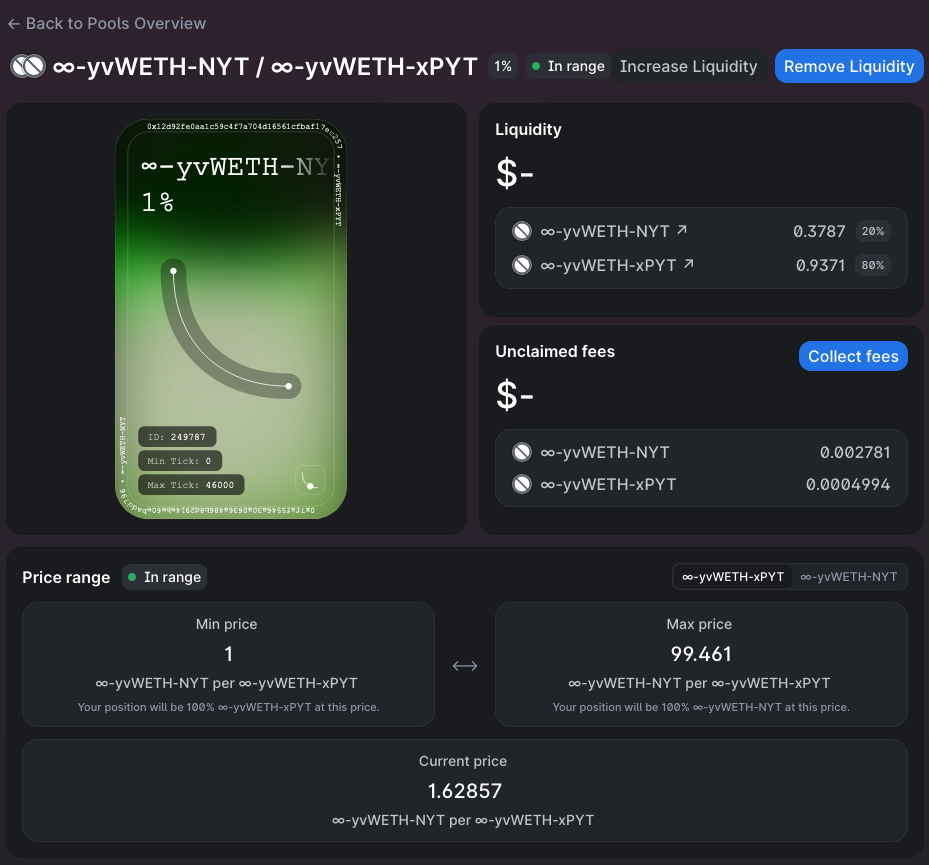

# Providing Liquidity

Timeless uses [Uniswap v3](https://uniswap.org/) as the underlying exchange, and liquidity providers provide xPYT-NYT liquidity.

## How to get xPYT & NYT to use for providing liquidity

Use the [Swap page](https://timelessfi.com/swap) on the Timeless website to buy the exact amount of xPYT & NYT you want.

Alternatively, use the [Mint page](https://timelessfi.com/mint) on the Timeless website to mint xPYT & NYT directly.

## How to view the pools to provide liquidity for

Use the [Pool page](https://timelessfi.com/pool) on the TImeless website to view the list of liquidity pools and provide liquidity.

## How to decide the price range to use

First of all, the price of 1 xPYT should always be at least 1 NYT, thus the lower price bound should be >=1 NYT. (To understand why, please read [the PYT docs](./pyt))

Secondly, the price of xPYT can theoretically go up to infinite NYT, but practically speaking something like 99 NYT should be large enough for the upper price bound. 1 PYT = 99 NYT corresponds to 1 PYT = 0.99 in terms of the underlying asset (e.g. USDC), which is very close to the upper limit of 1.

If you increased the upper limit to 999 NYT (a factor of 10.09x), then it corresponds to 1 PYT = 0.999 underlying, a mere 0.9% increase.

:::note

Due to the auto-compounding of xPYT, it's usually the case that 1 xPYT > 1 PYT. You can check the exact conversion rate on the [Swap page](https://timelessfi.com/swap). You should apply this conversion rate in your calculations.

For example, if the price range you're using is 1 NYT/xPYT ⟷ 99 NYT/xPYT, and 1 xPYT = 2 PYT, then the price range in PYT is (1/2) NYT/PYT ⟷ (99/2) NYT/PYT, which is 0.5 NYT/PYT ⟷ 49.5 NYT/PYT.

:::
