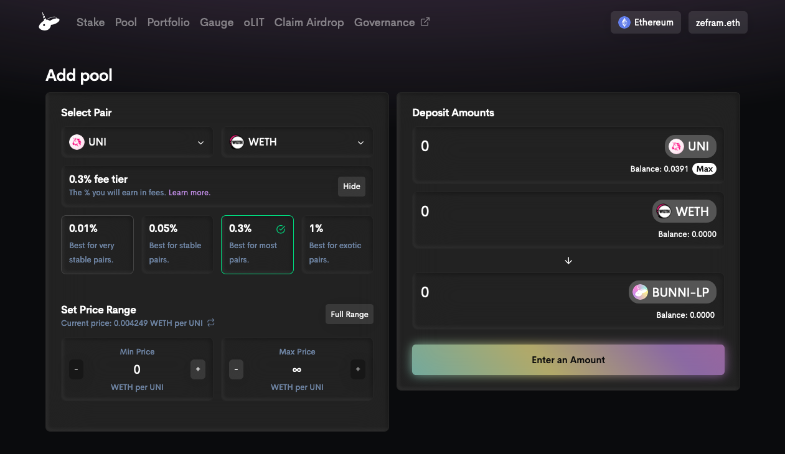
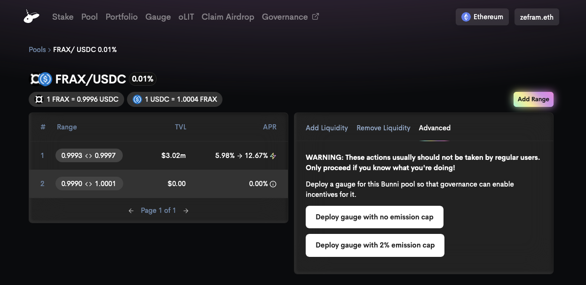

# Deploying a gauge

Deploying a Bunni [gauge](../tokenomics/gauges) is permissionless. After a gauge is deployed, [veLIT](../tokenomics/velit) holders must approve a gauge via governance in order to enable distributing oLIT incentives to the gauge.

The following are the steps for correctly deploying a gauge so that it can be approved by governance.

## Step 1: Add liquidity to desired pool & range

1. Go to https://bunni.pro/pools
2. Click "Add Pool"
3. Select tokens and fee tier
4. Select price range
   - Keep in mind that Bunni does not support rebalancing, so you should be confident that the price won't go out of range any time soon. If the price does go out of range, your gauge will stop receiving incentives.
5. Provide liquidity
   - The amount of liquidity can be small, e.g. $0.01

## Step 2: Deploy gauge contract

1. Go to https://bunni.pro/pools
2. Click the pool you want to deploy a gauge for
3. Click the range you want to deploy a gauge for
4. Go to the "Advanced" tab
5. Click one of the deploy buttons
   - Deploying a gauge with 2% emission cap can make it easier for you to convince governance to approve the gauge
6. Submit the transaction in your wallet