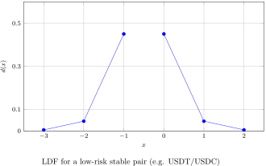
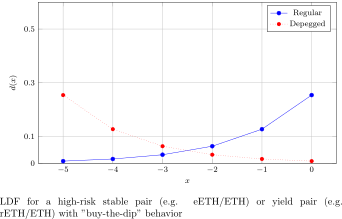
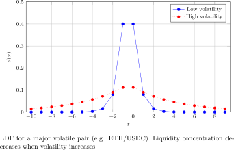

# Example Scenarios

This section provides example scenarios for different types of token pairs in Bunni v2, demonstrating how various features can be combined to create optimal liquidity strategies. These examples showcase the flexibility and power of Bunni v2's design.

## 1. Low-risk Stable Pair: USDT/USDC

### Liquidity Distribution

- Use a static double-geometric distribution heavily concentrated around 1 USDT/USDC.
- Alternatively, use a flat distribution.
- No need for autonomous rebalancing due to static distribution.

### Rehypothecation
- Enable rehypothecation for both USDT and USDC using lending platforms like Aave.
- Example parameters: $\phi_{min} = 5\%$, $\phi_{target} = 10\%$, $\phi_{max} = 15\%$

### Other Considerations
- Low risk of impermanent loss
- Focus on maximizing swap volume and fee revenue

## 2. High-risk Stable Pair: eETH/ETH

### Liquidity Distribution

- Use an asymmetric geometric distribution with maximum liquidity at 1 ETH/eETH.
- Enable morphing for "buy-the-dip" behavior during depegging events.
- Small TWAP window (1-5 minutes) for quick response to depeg events.

### Rehypothecation
- Enable rehypothecation for eETH using weETH vault.
- Consider rehypothecation for ETH using lending protocols like Aave or Gearbox.
- Set higher $\phi_{target}$ for ETH and lower for eETH to facilitate low gas cost swaps from eETH to ETH.

### Other Considerations
- No need for autonomous rebalancing under normal conditions.
- Enable surge fees to protect against potential sandwich attacks during depegging events.

## 3. Yield Pair: rETH/ETH

### Liquidity Distribution
- Use an asymmetric distribution similar to eETH/ETH.
- Enable shifting to regularly reconcentrate liquidity at the latest peg value.
- Implement "buy-the-dip" behavior for potential depeg events.

### Autonomous Rebalancing
- Enable autonomous rebalancing to handle token imbalances caused by shifting.

### Rehypothecation
- No need to rehypothecate rETH as it already accrues yield from ETH staking.
- Enable rehypothecation for ETH using lending platforms like Aave or Gearbox.
- Use higher $\phi_{target}$ for ETH to facilitate low gas cost swaps.

## 4. Major Volatile Pair: ETH/USDC

### Liquidity Distribution

- Use a symmetric double-geometric distribution concentrated around the TWAP or oracle price.
- Enable morphing based on ETH volatility:
  - Less concentrated liquidity during high volatility periods.
  - More concentrated liquidity during low volatility periods.
- Consider switching to a distribution concentrated away from the current price during extreme volatility.

### Autonomous Rebalancing
- Enable autonomous rebalancing to handle frequent liquidity distribution changes.

### Rehypothecation
- Enable rehypothecation for both ETH and USDC using lending platforms.
- Use moderate $\phi_{target}$ values (25-50%) due to ETH's relatively lower volatility compared to minor cryptocurrencies.

### Other Considerations
- Implement am-AMM for optimal fee setting and MEV capture.
- Use surge fees to protect against sandwich attacks during shapeshifting events.

## 5. Minor Volatile Pair: GEAR/ETH

### Liquidity Distribution
- Use a simple double-geometric distribution concentrated around the oracle price.
- Consider an asymmetric distribution with slightly more weight on the ETH side to provide more bids for GEAR.
- Enable shifting to adjust to market changes.

### Autonomous Rebalancing
- Enable autonomous rebalancing to handle token imbalances caused by shifting.

### Rehypothecation
- Disable rehypothecation for GEAR due to limited yield opportunities and to reduce gas costs for buying GEAR.
- Enable rehypothecation for ETH with a lower $\phi_{target}$ (e.g., 5%) to increase yield and slightly discourage selling GEAR into ETH.

### Other Considerations
- Implement am-AMM for optimal fee setting and MEV capture.
- Use surge fees to protect against potential manipulation in a less liquid market.

## Conclusion

These examples demonstrate the flexibility and power of Bunni v2 in creating tailored liquidity strategies for various token pairs. By combining features like shapeshifting, autonomous rebalancing, rehypothecation, and am-AMM, Bunni v2 allows liquidity providers to optimize their positions based on the specific characteristics and risks of each token pair.

It's important to note that these are example strategies and may need to be adjusted based on real-world performance and changing market conditions. Liquidity providers should carefully consider their risk tolerance and conduct thorough analysis before implementing any strategy.

Furthermore, as the DeFi ecosystem evolves, new opportunities and challenges may arise, requiring adaptation of these strategies. The programmable nature of Bunni v2 allows for continuous refinement and optimization of liquidity provision strategies to meet the ever-changing demands of the market.