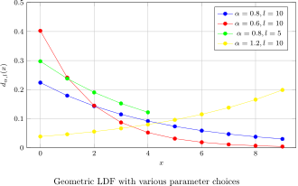
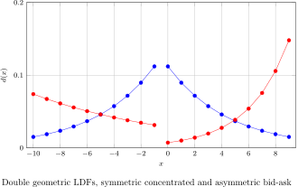

# Liquidity Density Functions (LDFs)

**Liquidity Density Functions (LDFs)** are a core concept in Bunni v2 that enable efficient liquidity distribution, modification, and swaps with constant gas costs. LDFs provide a new language for specifying liquidity distributions that builds directly on top of Uniswap v3's concept of ticks.

## What are LDFs?

An LDF is a normalized function that defines how liquidity is distributed over "ricks" (rounded ticks) in a Bunni v2 pool. Mathematically, an LDF is a function $LDF_w: R \rightarrow [0, 1]$, where $R$ is the rick space and $w$ is the tick spacing.

Given a pool with total liquidity $L$ and liquidity $l_r$ at rick $r$, we can compute $l_r$ using the LDF:

$$l_r = L \cdot LDF_w(r)$$

LDFs are normalized, meaning that $\sum_r LDF_w(r) = 1$.

## Rick Indices

To simplify the representation of LDFs, we can use rick indices. Given tick spacing $w$, rick $r$, and origin $\mu$, the rick index $x$ is defined as:

$$x = \frac{r - \mu}{w}$$

This allows us to represent an LDF alternatively as:

$$d(x) = LDF_w(wx + \mu)$$

$$LDF_w(r) = d(\frac{r - \mu}{w})$$

## Example: Geometric Distribution

A basic example of an LDF is the geometric distribution. Given exponent $\alpha \in \mathbb{R}_{>0} \setminus \{1\}$ and length $l \in \mathbb{Z}_{>0}$, the geometric LDF is defined as:

$$
d_{\alpha,l}(x) = \begin{cases}
    \frac{\alpha^x(1-\alpha)}{1-\alpha^l} & x \in [0, l) \cap \mathbb{Z} \\
    0 & \text{otherwise}
\end{cases}
$$

This distribution allocates liquidity over $l$ ricks following a geometric pattern. By adjusting the origin $\mu$, the LDF can be shifted over the rick space. By modifying $\alpha$ and $l$, the shape of the distribution can be changed.

## Cumulative Amount Functions (CAFs)

Each LDF has two associated Cumulative Amount Functions (CAFs), $A_0: R \cup r_{max} + w \rightarrow \mathbb{R}_{>0}$ and $A_1: R \cup r_{min} - w \rightarrow \mathbb{R}_{>0}$, one for each token in a pool. CAFs are essential for computing liquidity modifications and swaps.

For token₀, the CAF at rick $\rho$ is defined as:

$$A_0(\rho) = \sum_{r=\rho}^{r_{max}} a_0(r)$$

where $a_0(r)$ is the amount of token₀ in rick $r$.

Similarly, for token₁:

$$A_1(\rho) = \sum_{r=r_{min}}^{\rho} a_1(r)$$

## Inverse Cumulative Amount Functions (ICAFs)

ICAFs are the inverse of CAFs and are crucial for computing swaps in constant time. For each LDF, there are two ICAFs, $A_0^{-1}(\cdot)$ and $A_1^{-1}(\cdot)$, defined as:

$$A_0^{-1}(y) = \argmin_{r \in R \cup \{r_{max}+w\}} \{A_0(r) : A_0(r) \leq y\}$$

$$A_1^{-1}(y) = \argmin_{r \in R \cup \{r_{min}-w\}} \{A_1(r) : A_1(r) \geq y\}$$

The computation of ICAFs depends on the specific LDF. For geometric LDFs, ICAFs can be computed via basic arithmetic operations in constant time.

## Composing LDFs

LDFs can be easily composed to create more complex distributions. Given two LDFs $LDF_a$ and $LDF_b$, a new LDF $LDF'$ can be created as:

$$LDF'(x) = w \cdot LDF_a(x) + (1-w) \cdot LDF_b(x), w \in [0, 1]$$

This composition property allows for the creation of sophisticated liquidity distributions tailored to specific market conditions or strategies.